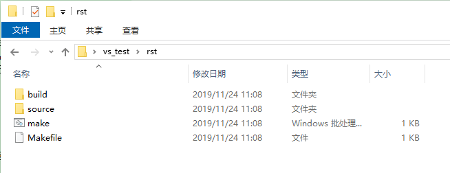

本文主要介绍Sphinx+Rst+Github+Read the Docs如何使用，主要用来编写生成在线文档，也可以生成pdf，文档推送到Github后还可以关联Read the Docs，完美托管软件代码与文档, 还具备打包功能，组合使用非常强大。Rst语言和Markdown类似，但相对于 **Mardown** 标记语言，RST语言功能更加强大，语言体系更加标准，配合Sphinx处理工具，可以写出非常漂亮的在线文档。

简介
====

reStructuredText
----------------

**reStructuredText** 是扩展名为 ``.rst`` 的纯文本文件，含义为“重新构建的文本”，是 **Python** 编程语言的 **Docutils** 项目的一部分。 ``.rst`` 文件是一种轻量级标记语言，与html的复杂结构相比，它的设计对人更加友好，被设计为容易阅读和编写的纯文本，并且可以借助 **Docutils** 这样的程序进行文档处理，也可以转换为html或pdf等多种格式，或由Sphinx这样的程序转换为man手册等更多格式。

Sphinx
------

**Sphinx** 是一种工具，它允许开发人员以纯文本格式编写文档，以便采用满足不同需求的格式轻松生成输出。它使用 **reStructuredText** 标记语法来提供文档控制，可以将 **Sphinx** 想像成为一种文档框架：它会抽象化比较单调的部分，并提供自动函数来解决一些常见问题，比如突出显示标题索引和特殊代码（在显示代码示例时），以及突出显示适当的语法。

Github
------

Github作为全球最大的社交编程及代码软件项目托管网站，支持 git作为唯一的版本库格式进行托管，还提供了订阅、讨论组、文本渲染、在线文件编辑器、协作图谱（报表）、代码片段分享（Gist）等功能。

Read the docs
-------------

Read the docs通过与Github关联，执行自动构建、版本控制和为您托管文档，阅读文档简化了软件文档。作为软件文档托管平台，对于Github开源项目/公开仓库服务是免费的。

pandoc
------
Pandoc是不同格式文件转换工具，可实现不同标记语言间的格式转换，如word文档转html。

环境搭建
========

安装Python环境
--------------

**Sphinx** 和 **reStructuredText** 是Python编程语言的一部分，所以需要先配置好Python环境。

1. 下载

在Python的 `官方网站 <https://www.python.org/downloads/windows/>`_  下载安装程序, 如 :numref:`python_web` 所示。根据所用系统是32位还是64位选择下载哪个进行安装。考虑到平时使用的相关插件不支持Python 3，故本文选择Python 2，可以根据自己的需要选择具体版本进行安装。

 .. _python_web:
 
 .. figure:: ./images/python_web.png
    :align: center

    Python官网

2. 安装
   
双击下载的Python软件，根据需要修改安装路径，默认安装路径为 ``C:\python27`` 。

3. 添加系统环境变量

将Python安装路径下的 ``C:\Python27\Scripts`` 和 ``C:\Python27`` 添加到系统环境变量中。

安装pip插件
-----------
   
pip也是一个Python的包管理工具，它和setuptools类似，但是pip比setuptools更好用，现在安装python包基本都是使用pip了。下载 `pip <https://pypi.org/project/pip/#files>`_ 插件，将下载的文件解压（解压到一个文件夹，用CMD控制台进入解压文件的目录 ，目录中不要包含汉字），进入解压目录，执行命令::

  >> python setup.py install

安装Sphinx插件
--------------

安装完成pip之后，即可很便利的安装各种Python插件了。安装 **Sphinx** 只需输入一下命令::

  >> pip install sphinx

即可完成 **Sphinx** 最新版本的安装。

.. note::

   因为Sphinx依赖其它的Python插件，因此强烈推荐使用在线安装。如果主机未能联网，可以先选择一台可联网的主机，安装好Python及其相关插件后，将整个安装文件夹（如默认安装，则是C:\Python27）拷贝过去也行。pip命令的使用在Windows环境即可。

sphinx-rtd-theme
----------------

这是Sphinx支持的一种网页主题之一，仅仅对生成HTML时有效。个人对这种主题比较喜爱，其它的不甚满意。安装方法和Sphinx的安装类似，输入以下命令即可以安装。

  >> pip install sphinx_rtd_theme

安装LaTeX
---------

LaTeX是一个高质量的排版系统，利用TeX格式，即使使用者没有排版和程序设计的知识也可以充分发挥由TeX所提供的强大功能，能在几天，甚至几小时内生成很多具有书籍质量的印刷品。对于生成复杂表格和数学公式，这一点表现得尤为突出。因此它非常适用于生成高印刷质量的科技和数学类文档。这个系统同样适用于生成从简单的信件到完整书籍的所有其他种类的文档。

Windows中常用的TeX编译引擎是 `MikTex <https://miktex.org/download>`_ ，如下图所示：

.. figure:: ./images/MiKTeX_Download.png
   :align: center

   下载MiKTeX

如果需要在移动设备中安装，请参考 `Portable Edition <https://miktex.org/howto/portable-edition>`_ 的操作。

这是Sphinx支持的一种常用于转换生成pdf的工具，下载完成后即可以安装。

sphinx支持MarkDown
------------------

可以在同一个Sphinx项目中使用Markdown和reStructuredText, 输入命令完成sphinx的MarkDown的基础支持::

  >> pip install recommonmark

然后在conf.py原有的 extensions 配置项多添加扩支持::

  >> extensions = ['recommonmark']

如果还要支持MarkDown的表格语法，还需要安装 sphinx-markdown-tables ::

  >> pip install sphinx-markdown-tables

如果是Python2, 还需在conf.py原有的 extensions 配置项再多添加扩支持 ::

  >> extensions = ['sphinx_markdown_tables'] 

增加完该配置项即变为如下所示，注意Python2还会多出一项 ``sphinx_markdown_tables' `` ::  

  >> extensions = ['sphinx.ext.imgmath',  
                   'sphinx.ext.todo',  
                   'sphinx.ext.autosectionlabel',  
                   'sphinx.ext.autosummary',  
                   'sphinx.ext.autodoc'， 
                   'recommonmark'] 

sphinx支持引用
--------------

在conf.py添加引用支持，这样生成的html页面就可以跳转::

  >> #添加新的配置项使能引用
  >> numfig = True

MarkDown的主题样式theme
-----------------------

在conf.py把sphix支持的后缀文件修改为也支持 ``.md `` 后缀的MarkDown文件 ::

  >> source_suffix = ['.rst', '.md'] 

如果是Python2,需在conf.py添加配置项即可::

  >> from recommonmark.parser import CommonMarkParser

  >> source_parsers = {'.md': CommonMarkParser,}

安装sublime编辑器
-----------------

推荐使用sublime编辑器编写RST文档，因为sublime有一个RST插件包，里面集成了许多快捷键，通过快捷键可以快速的插入相关RST语法命令。

1. 下载安装

根据电脑系统配置，选择对应版本的 `Sublime <http://www.sublimetext.com/3>`_ 下载。下载完成后，双击安装即可。

2. 安装RST插件
   
下载 `sublime-rst-completion <https://github.com/mgaitan/sublime-rst-completion>`_ 插件包。下载完成后，运行 **Sublime Text 3** ，在菜单栏中依次选择：【Preferences】->【Browse Packages...】，将插件解压到打开的 *Packages* 文件夹中，安装该插件后支持RST语法快捷键的输入。

.. figure:: ./images/add_sublime_rst_completion.png
   :align: center

   添加rst插件

pandoc安装
----------

pandoc的软件及安装说明：https://github.com/jgm/pandoc/blob/master/INSTALL.md。安装完成后，感兴趣的可以查看pandoc用户手册：https://pandoc.org/MANUAL.html    

FAQ
---
有些新的版本对应的Python环境不同，有可能安装了用不了，可以采用以下的方法安装相关工具及设置环境：

1. 利用相关同事安装并测试好的Latex版本压缩包，解压缩 MiKTeX 2.9.7z 至 C:\Program Files\

2. 解压缩 MiKTeX(ProgramData).7z 至 C:\ProgramData\

3. 解压缩 MiKTeX(AppData-Local).7z 至 C:\Users\$UNAME$\AppData\Local\  $UNAME$ 为你的计算机用户名

4. 解压缩 MiKTeX(AppData-Roaming).7z 至 C:\Users\$UNAME$\AppData\Roaming\  $UNAME$ 为你的计算机用户名

5. 添加系统环境变量: C:\Program Files\MiKTeX 2.9\miktex\bin\x64;

6. 安装完Python时还需添加环境变量: C:\Python27\Scripts；C:\Python27\Scripts

7. 还需安装make工具，本文使用的msys提供的make工具。安装完成后，添加如下环境变量: C:\msys\1.0; C:\msys\1.0\bin    

创建编辑
========

创建文件夹
----------

创建一个文件夹用于存放即将编写的RST文档，以本文为例，创建的文件夹名称为： *rst* 。
   
.. note:: 

   文件夹路径不要包含中文路径名称，Sphinx的Python环境对中文的支持不是很友好，但需要很多配置项。

创建编辑环境
------------

打开控制台窗口，既可以使用Windows系统自带的CMD控制台程序，也可以使用第三方的控制台。如果使用Windows自带的CMD控制台界面，按下键盘中的Win + R快捷键，打开运行窗口，在输入栏中输入cmd，回车，打开 Windows 控制台界面。如下所示：

.. figure:: ./images/win_run.png
   :align: center

   打开运行界面

输入命令，进入刚刚创建的文件夹目录后，输入命令创建编辑环境::

  >> sphinx-quickstart

之后根据提示输入即可。如下所示：

.. figure:: ./images/sphinx-quickstart.png
   :align: center

   sphinx-quickstart

个人推荐文档编辑生成目录和文档目录最好分开，因此从创建时，选择 `` Separate source and build directories (y/n) [n]: y`` 选择的是y。创建完成之后，如下图所示：

   创建完成生成效果

主要的文件有：

- build
- source
- make
- Makefile

build用来存放文档编译过程中的中间文件以及最终生成的文件；source用来存储用户实际的文档；make和Makefile文件是不同平台下是用来生成文档时使用的。

进入 *source* 目录，主要有两个文件，一个index文件，还有一个Sphinx相关的Python配置文件conf.py。index文件该文件是用来组织整片文档目录结构的，打开 index.rst 文档，中间位置代码为::

  .. toctree::
     :maxdepth: 2
     :caption: Contents:

     添加新的rst文件(eg:P100.rst)
 
后续即可在后面添加新建的文档了，如新建了一个test.rst文档，即可在后面添加 test 文件名称即可。

::

  .. toctree::
     :maxdepth: 4
     :caption: Contents:

     test

Python配置文件conf.py主要是更改生成文档的主题，生成文档的名称，使用的语言，还用更改生成文档的一些参数，前面也有一些了介绍，如 :ref:`sphinx支持引用` 所示。

Rst文档编辑完成及conf.py作好相对应的修改后，即可在文档根目录下(本文即rst目录)，输入 ``make``  会弹出不同输出格式的编译命令，如果需要编译输出 ``html``，只需输入::

  >> make html

最终在 ``build/html`` 中生成的相应的 ``html``文档。

.. note::

   如果生成PDF，需要先使用make latex生成tex文件，之后进入build\\latex，在终端界面输入 ``make`` 命令，即可生成最终的PDF文件。
   
至此，如果成功编译出html与pdf文当，环境搭建成功，如 :numref:`teaching_book`  :numref:`teaching_html`  所示。 

 .. _teaching_html:
 
 .. figure:: ./images/html.png
    :align: center
 
    生成html  

 .. _teaching_book:
 
 .. figure:: ./images/pdf.png
    :align: center
 
    生成pdf

Rst标记语言语法
===============

标题     
----

一些常见的标题语法如下所示，详细定义见 :numref:`title_languae`。

 .. code-block:: c
    :caption: 标题语法
    :name: title_languae
    :linenos:

     一级标题
     ========

     二级标题
     ~~~~~~~~

     三级标题
     --------

     四级标题
     ^^^^^^^^

段落     
----

Rst中，通过一个或一个以上空行隔开的文本块是一个段落。 如果没有空行隔开，则Rst认为是同一个段落，会连在一起作为一行。Rst中的缩进非常重要，同一段落的多个文本行必须有一样的缩进。

在段落内换行并不会在html中生成换行符，要想保持在文本编辑器中的换行符，需要在这些行前面都加上 ``|`` 和空格，如 :numref:`duanluo_languae`所示。

 .. code-block:: c
    :caption: 段落语法
    :name: duanluo_languae
    :linenos:

      | 换到下一行显示 
      | 接上一行显示

行内标记
--------

 | 字体加粗 : 两个星号 **加粗** 
 | 字体倾斜 : 一个星号 *倾斜* 
 | 字体引用 : 两个反引号 ``引用`` 

表格
----

{SDK}\\atk\\stm32f103zet6目录中的还有几个.h文件，主要定义了该芯片通用的一些内容，如引脚号、中断号、DMA通道号等。各文件内容简介如 :numref:`am_mb_parity_table` 所示。

 .. table:: stm32f103zet6芯片各公共文件内容简介
    :name: am_mb_parity_table

    +---------------------+------------------------------------------------------------------------------------------------------+
    | 文件名              | 内容简介                                                                                             |
    +=====================+======================================================================================================+
    | atk_common.h        | 公共头文件                                                                                           |
    +---------------------+------------------------------------------------------------------------------------------------------+
    | atk_sys.h           | 系统头文件                                                                                           |
    +---------------------+------------------------------------------------------------------------------------------------------+
    | atk_delay.h         | 延时投文件                                                                                           |
    +---------------------+------------------------------------------------------------------------------------------------------+
    | atk_uasart.h        | 串口头文件                                                                                           |
    +---------------------+------------------------------------------------------------------------------------------------------+

.. attention::
     表格示例。

源代码及高亮
------------

一些全局外设，如CLK、GPIO、INT等，由于需要在全局使用，因此在系统启动时已默认初始化，在应用程序需要使用时，无需再重复初始化，直接使用即可。相关的宏在工程配置文件{PROJECT}\\user_config\\atk_config.h中定义。

以GPIO为例，其对应的使能宏为：ATK_CFG_GPIO_ENABLE，详细定义见 :numref:`gpio_init_on_off` 。宏值默认为1，即GPIO外设在系统启动时自动初始化，如果确定系统不使用GPIO资源或希望由应用程序自行完成初始化操作，则可以将该宏的宏值修改为0。

 .. code-block:: c
    :caption: GPIO自动初始化使能/禁能配置
    :name: gpio_init_on_off
    :emphasize-lines: 2    
    :linenos:

     /** \brief 为1，初始化 GPIO 的相关功能 */
     #define ATK_CFG_GPIO_ENABLE 1
     #define ATK_CFG_GPIO_NUM    2

.. attention::
     源代码示例。

引用
----

引用图片
^^^^^^^^ 

常见的引用图片语法如下所示，详细定义见 :numref:`pic_language` 。 

 .. code-block:: c
    :caption: 引用图片语法示例
    :name: pic_language  
    :linenos:

     如 :numref:`pic_eg` 所示

     .. _pic_eg:
     
     .. figure:: ./images/pdf.png
        :align: center
     
        引用图片语法示例

如 :numref:`pic_eg` 所示, 即为图片语法示例的效果。 

 .. _pic_eg:
 
 .. figure:: ./images/pdf.png
    :align: center
 
    引用图片示例效果

超链接
^^^^^^

常见的超链接语法如下所示，详细定义见 :numref:`url_language` 。 

 .. code-block:: c
    :caption: 超链接语法示例
    :name: url_language  
    :linenos:

     `正点原子论坛官网 <http://www.openedv.com/>`_

通过超链接嵌入网址，效果见紧接着: `正点原子论坛官网 <http://www.openedv.com/>`_ 。

更多语法请参考
--------------

更多的Rst语法示例可以参考本文档的写法，自行学习RST语法与sphinx使用方法，请参考以下网站::

sphinx语法官网：http://www.sphinx-doc.org/en/master/usage/restructuredtext/basics.html  

restruct语法官网：http://docutils.sourceforge.net/rst.html     

Read the Docs与Github关联
=========================

首先使用Github账号关联注册Read the Docs后，如 :numref:`readthedocs_signin` 所示。

 .. _readthedocs_signin:
 
 .. figure:: ./images/readthedocs_signin.png
    :align: center
 
    注册Read the Docs账号

可将编写好的 rst 文件上传至 Github 相对应的仓库，然后从 Read the Docs 导入 Github 相关项目，点击 Import a Project 按钮，即可看到 Github 项目(仓库)列表，选择项目导入。这样可通过 Read the Docs 对文档进行编译、版本控制等，如 :numref:`import_project` 所示。

 .. _import_project:

 .. figure:: ./images/importprjpng.png
    :align: center
 
    导入Github相应的项目

如果本地编译生成文档通过，点击 ``Builds Version`` 按钮，对文档进行编译，编译成功后点击 ``阅读文档``  按钮，即可查看文档，如 :numref:`doc_buildok`  :numref:`viewdocok` 所示。

  .. _doc_buildok:

  .. figure:: ./images/importprjpng.png
    :align: center

    构建文档

  .. _viewdocok:
 
  .. figure:: ./images/view_doc.png
    :align: center
 
    查看文档

.. note::
   Read the docs可以配置构建文档使用的参数，有兴趣的可以自已去尝试。        

打包下载生成的html文件，以便快速部署在公司的服务器上面，如 :numref:`package_doc` 所示。

  .. _package_doc:
 
  .. figure:: ./images/packagedoc.png
    :align: center
 
    打包下载HTML文件以便部署到公司服务器

   
部署到公司服务器
================

Read the DocsS构建后部署
------------------------
   
可以依靠Read the docs 生成的html的文件，下载下来解压把html相关的文件夹部署到公司对应的服务器上面，例如本文的路径为: http://www.openedv.com/ATK-Prod/test/git-rst-test-latest/index.html

本地编译后部署
--------------

本地编译后,打开所生成的html文件，替换掉所有html文件含有View page source内容的一个节点为对应github项目仓库对应的url地址，如本文替换为 ``<a href="https://github.com/longdelu/git_rst_test/blob/master/source/index.rst" class="fa fa-github"> Edit on alientek</a>``，然后把html相关的文件夹部署到公司对应的服务器上面，例如本文的路径为: http://www.openedv.com/ATK-Prod/test/html/index.html

.. note::
   路径可以通过服务器管理员修改。

